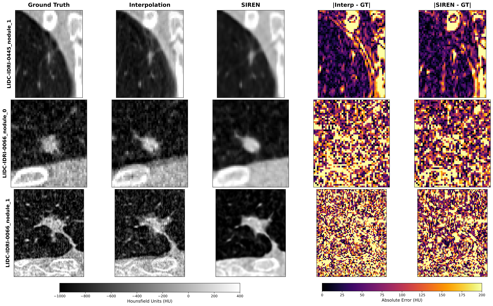
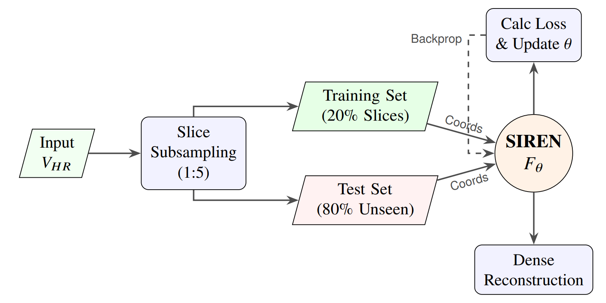
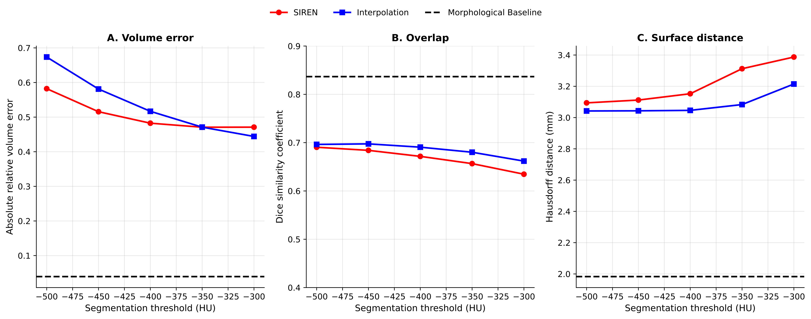
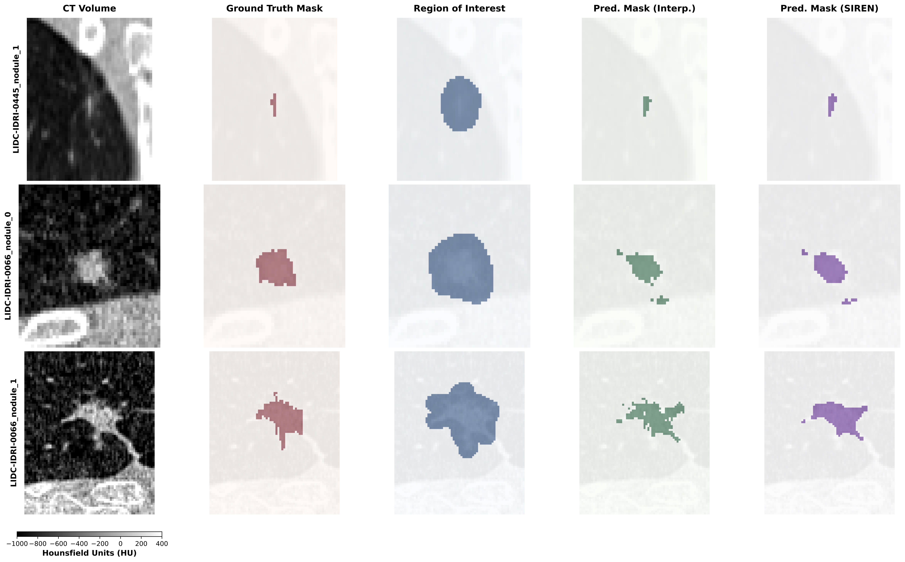
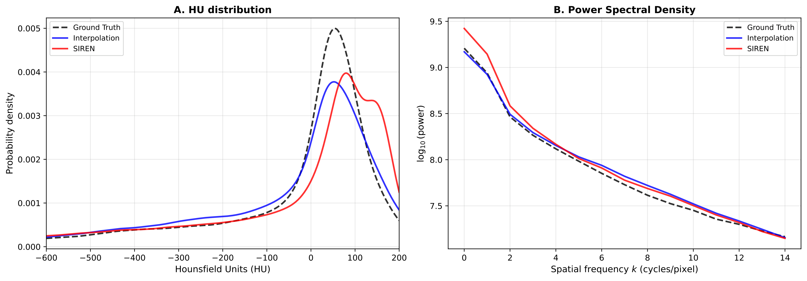
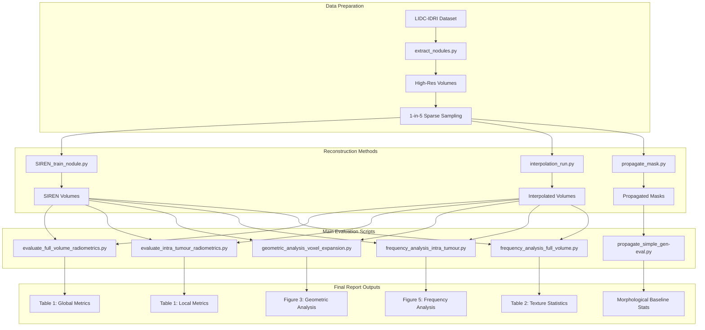

# Implicit Neural Representations for Sparse CT Reconstruction of Pulmonary Nodules

[](https://www.python.org/downloads/)
[](https://pytorch.org/)
[](https://developer.nvidia.com/cuda-toolkit)
[](https://opensource.org/licenses/MIT)

> **Evaluating SIREN-based volumetric recovery against traditional interpolation for lung nodule characterization in sparse clinical CT acquisitions**

---

## Table of Contents

- [Abstract](#abstract)
- [Key Findings](#key-findings)
- [Performance Summary](#performance-summary)
- [Methodology](#methodology)
- [Testing](#testing)
- [Installation](#installation)
- [Repository Structure](#repository-structure)
- [Usage](#usage)
- [Experimental Pipeline](#experimental-pipeline)
- [Results & Discussion](#results--discussion)
- [Technical Implementation](#technical-implementation)
- [Limitations & Future Work](#limitations--future-work)
- [Citation](#citation)
- [License](#license)

---

## Abstract

Accurate pulmonary nodule assessment relies on volumetric CT imaging, yet clinical thick-slice acquisitions (2.5-5mm intervals) suffer from data sparsity that degrades both geometric shape and internal texture required for radiomics-based characterization. This study evaluates **Sinusoidal Representation Networks (SIREN)**—a class of Implicit Neural Representations (INRs)—for recovering volumetric density from sparse CT data.

Using lung nodules from the **LIDC-IDRI dataset** (N=50 test set), we benchmark SIREN against longitudinal cubic interpolation and morphological baselines under a strict **1-in-5 slice training protocol** (simulating 80% missing data). Performance is evaluated on two critical axes:

1. **Geometric Consistency**: Shape fidelity and boundary definition
2. **Radiometric Fidelity**: Internal density and texture preservation

### Key Contributions

A **distinct performance dichotomy** emerges:

- **For Global Reconstruction**: SIREN achieves **15.6% reduction in RMSE** and **5.8% improvement in PSNR** by recovering high-frequency anatomical boundaries and structural context
- **For Intra-tumor Core**: Cubic interpolation yields lower error rates within homogeneous soft tissue, with **65.4% lower MSE** and **23.1% lower RMSE**, suggesting linear methods remain effective for variance minimization in smooth regions
- **For Geometric Shape**: Morphological baseline outperforms both density-based methods, indicating that gross tumor topology is adequately captured by linear assumptions

This reveals a fundamental **spectral trade-off**: while INRs excel at structural recovery and boundary sharpness (critical for visualization and feature extraction), linear interpolation minimizes voxel-wise variance within uniform tissue. The findings highlight the need for **context-dependent reconstruction strategies** in clinical AI workflows.

---

## Key Findings

### Figure 1: Radiometric Reconstruction Quality



**Visual reconstruction fidelity** on three nodules (unseen central slices):

- **Row 1** (LIDC-IDRI-0445): Very small nodule where both methods struggle—elevated residuals visible in heatmaps
- **Rows 2-3** (LIDC-IDRI-0066): Larger nodules demonstrating SIREN's advantage
  - **Columns 1-3**: Ground truth vs. interpolation vs. SIREN. SIREN reconstructions exhibit **greater smoothness in anatomical background**, consistently limiting noise artifacts
  - **Row 3**: Complex case with nodule attached to non-tumorous tissue. Interpolation blurs the interface, while SIREN maintains better **structural definition at boundaries**

**Error Distribution (Columns 4-5)**:
- **Interpolation**: Structurally correlated errors concentrated along high-gradient edges, creating distinct "error rings" around nodule periphery
- **SIREN**: Spectrally distributed high-frequency noise avoiding large structural deviations, but higher variance within homogeneous tumor core

---

### Figure 2: Instance-Specific Training Pipeline



**Training methodology**: A unique SIREN network is optimized for each patient. The model overfits the sparse Training Set (top path, 20% of slices with 1:5 subsampling) to learn the implicit volume representation, then reconstructs the unseen Evaluation Views (bottom path, 80% unseen). The network learns a continuous function F_θ that maps spatial coordinates to radiodensity values, enabling dense reconstruction from sparse acquisitions.

**Key aspects**:
- **Input**: High-resolution CT volume (V_HR) with slice thickness ≤ 1.0mm
- **Training Set**: Every 5th slice (20%) used for backpropagation and parameter updates
- **Test Set**: Intermediate slices (80% unseen) used for evaluation only
- **Per-instance optimization**: Each nodule receives a dedicated network trained from scratch, allowing maximum overfitting to patient-specific anatomy

---

### Figure 3: Geometric Performance vs. Segmentation Threshold

> *Generated by: [`scripts/geometric_analysis_voxel_expansion.py`](scripts/geometric_analysis_voxel_expansion.py)*



**Key Takeaways:**
- The horizontal dashed line represents the **morphological baseline** (simple linear mask propagation), which achieves DSC=0.837 ± 0.061, HD=1.98 ± 0.55mm, ARVE=0.039 ± 0.048
- Both SIREN and cubic interpolation-based density thresholding **underperform** the morphological baseline across all geometric metrics
- **Panel A**: SIREN achieves higher volume error (ARVE) than interpolation at all thresholds, with ARVE values ranging from 0.47-0.58 for SIREN vs 0.44-0.67 for interpolation
- **Panel B**: Cubic interpolation maintains consistently higher overlap (DSC) than SIREN across all thresholds, with the gap widening at higher thresholds
- **Panel C**: SIREN exhibits greater boundary distance error (HD) that worsens with increasing threshold, reaching 3.39mm at -300 HU vs 3.21mm for interpolation

**Clinical Implication**: For gross tumor volume estimation, simple shape propagation is more reliable than density-based segmentation from reconstructed volumes.

---

### Figure 4: Qualitative Segmentation Comparison



**Three representative test cases** (unseen intermediate slices from 1-in-5 protocol):

- **Top row** (LIDC-IDRI-0066_0): Small isolated nodule with slight centroid shift in both methods, contributing to Hausdorff errors despite accurate size recovery
- **Middle row** (LIDC-IDRI-0066_1): High-density non-tumorous structure (likely bone) within ROI incorrectly segmented as tumor by both density-based methods—demonstrating fundamental limitation of intensity thresholding
- **Bottom row** (LIDC-IDRI-0445_1): Juxtapleural nodule attached to isodense tissue. SIREN shows superior boundary smoothness vs. discretization artifacts in interpolation, though both struggle to separate tumor from adjacent structure

**Key Observation**: SIREN's continuous implicit representation produces smoother boundaries but cannot overcome the inherent ambiguity of density-based segmentation in complex anatomical contexts.

---

### Figure 5: Texture Preservation & Spectral Analysis

> *Generated by: [`scripts/frequency_analysis_intra_tumour.py`](scripts/frequency_analysis_intra_tumour.py)*



**Panel A: Hounsfield Unit Distribution** (intra-tumor only)
- **Ground Truth**: Sharp peak with heavy tails (Kurtosis=4.62 ± 5.15), characteristic of heterogeneous malignant tissue
- **Cubic Interpolation**: Flattened distribution with reduced peak density (Kurtosis=3.13 ± 1.61)—over-smoothing effect; variance ratio 1.065 ± 0.137 (slightly inflates texture variance, p=0.0015)
- **SIREN**: Intermediate peak sharpness (Kurtosis=3.59 ± 2.89), better preservation of non-Gaussian texture statistics, but displays secondary "shoulder" at 100-150 HU (potential over-representation of high-density voxels); variance ratio 1.099 ± 0.158 (more pronounced variance inflation, p=0.0001)

**Panel B: Power Spectral Density**
- SIREN exhibits slightly elevated power at **low spatial frequencies** (k < 2 cycles/pixel)
- At medium-to-high frequencies, spectral profiles of all methods converge—suggesting SIREN's advantage is in **structural coherence** rather than fine-scale texture recovery

**Interpretation**: SIREN better preserves the **statistical signature** of malignant heterogeneity (kurtosis) compared to interpolation, despite higher local voxel-wise error. However, both methods show statistically significant variance inflation within the tumor core (interpolation: p=0.0015, SIREN: p=0.0001), with SIREN showing significantly greater inflation than interpolation (p=0.0313).

---

## Performance Summary

### Radiometric Fidelity: Global vs. Local Performance

> *Global metrics from: [`scripts/evaluate_full_volume_radiometrics.py`](scripts/evaluate_full_volume_radiometrics.py)*  
> *Local metrics from: [`scripts/evaluate_intra_tumour_radiometrics.py`](scripts/evaluate_intra_tumour_radiometrics.py)*

| Metric | **Global (Full Slice)** |  |  | **Local (Intra-Tumor)** |  |  |
|--------|------------|---------|---------|------------|---------|---------|
|        | **Interp.** | **SIREN** | **Winner** | **Interp.** | **SIREN** | **Winner** |
| **MSE** | 0.00407 ± 0.00264 | **0.00288 ± 0.00183** | SIREN (-29.2%) | **0.01649 ± 0.01115** | 0.02728 ± 0.02671 | Interp. (-65.4%) |
| **MAE** | 0.03317 ± 0.01174 | **0.03046 ± 0.01121** | SIREN (-8.2%) | **0.08403 ± 0.02870** | 0.10915 ± 0.05255 | Interp. (-29.9%) |
| **RMSE** | 0.06063 ± 0.02007 | **0.05118 ± 0.01639** | SIREN (-15.6%) | **0.12290 ± 0.03761** | 0.15128 ± 0.06697 | Interp. (-23.1%) |
| **PSNR (dB)** | 24.83 ± 2.96 | **26.26 ± 2.84** | SIREN (+5.8%) | **18.58 ± 2.58** | 17.20 ± 3.80 | Interp. (+7.5%) |
| **SSIM** | 0.8685 ± 0.0890 | **0.8925 ± 0.0773** | SIREN (+2.8%) | **0.7786 ± 0.1354** | 0.7457 ± 0.1336 | Interp. (+4.2%) |

**Critical Finding**: A clear **performance dichotomy** exists. SIREN dominates in global structural recovery (driven by high-contrast anatomical boundaries) with modest but consistent improvements across all metrics, while linear interpolation achieves substantially lower error within the homogeneous tumor core.

---

### Geometric Consistency Metrics

> *Generated by: [`scripts/geometric_analysis_voxel_expansion.py`](scripts/geometric_analysis_voxel_expansion.py)*  
> *Morphological baseline from: [`scripts/propagate_simple_gen-eval.py`](scripts/propagate_simple_gen-eval.py)*

| Method | Threshold | DSC (↑) | Hausdorff (mm) (↓) | ARVE (↓) |
|--------|-----------|---------|-------------------|----------|
| **Morphological Baseline** | — | **0.837 ± 0.061** | **1.98 ± 0.55** | **0.039 ± 0.048** |
| **Cubic Interpolation** | -500 HU | 0.696 ± 0.152 | 3.04 ± 0.609 | 0.674 ± 0.727 |
| | -450 HU | 0.697 ± 0.154 | 3.04 ± 0.624 | 0.581 ± 0.644 |
| | -400 HU | **0.691 ± 0.160** | 3.05 ± 0.609 | 0.517 ± 0.568 |
| | -350 HU | 0.680 ± 0.168 | 3.08 ± 0.591 | 0.471 ± 0.508 |
| | -300 HU | 0.662 ± 0.179 | 3.21 ± 1.235 | **0.444 ± 0.449** |
| **SIREN** | -500 HU | **0.691 ± 0.160** | 3.09 ± 0.648 | 0.582 ± 0.682 |
| | -450 HU | 0.684 ± 0.165 | 3.11 ± 0.653 | 0.516 ± 0.612 |
| | -400 HU | 0.672 ± 0.175 | 3.15 ± 0.693 | 0.483 ± 0.552 |
| | -350 HU | 0.657 ± 0.184 | 3.31 ± 1.249 | 0.471 ± 0.492 |
| | -300 HU | 0.635 ± 0.198 | 3.39 ± 1.334 | 0.471 ± 0.445 |

**Conclusion**: Morphological baseline significantly outperforms both density-based approaches, demonstrating that **shape interpolation is more reliable than density thresholding** for geometric consistency.

---

### Texture Statistics: Frequency & Statistical Analysis

> *Full volume from: [`scripts/frequency_analysis_full_volume.py`](scripts/frequency_analysis_full_volume.py)*  
> *Intra-tumor from: [`scripts/frequency_analysis_intra_tumour.py`](scripts/frequency_analysis_intra_tumour.py)*

|  | **Full Volume** |  |  | **Intra-Tumor** |  |  |
|--|---------|--------|---------|---------|--------|---------|
| **Metric** | **GT** | **Interp.** | **SIREN** | **GT** | **Interp.** | **SIREN** |
| Mean (HU) | -639 ± 149 | **-642 ± 144** | -646 ± 146 | -133 ± 163 | **-158 ± 157** | -186 ± 176 |
| Std Dev (HU) | 360 ± 112 | **345 ± 100** | 343 ± 115 | 206 ± 65 | **213 ± 46** | 222 ± 57 |
| Std Ratio | 1.00 | **0.966 ± 0.044** | 0.943 ± 0.069 | 1.00 | **1.065 ± 0.137** | 1.099 ± 0.158 |
| **Kurtosis** | 7.49 ± 8.89 | 6.18 ± 6.73 | **6.81 ± 7.90** | 4.62 ± 5.15 | 3.13 ± 1.61 | **3.59 ± 2.89** |

**Key Insight**: While SIREN has higher voxel-wise error locally, it recovers the **non-Gaussian kurtosis** significantly better than interpolation (+14.7% vs. -32.3%), preserving the statistical signature of heterogeneous malignant tissue. Statistical tests confirm both methods significantly deviate from perfect variance preservation (p<0.001 for global, p<0.05 for intra-tumor).

---

## Methodology

### Dataset: LIDC-IDRI Selection

This study uses the **Lung Image Database Consortium (LIDC-IDRI)**, a publicly available thoracic CT dataset with expert radiologist annotations. Strict inclusion criteria ensure high-quality ground truth:

- **Slice thickness**: d_z ≤ 1.0 mm (high-resolution axial sampling)
- **Malignancy score**: Average radiologist score > 3 (focus on clinically significant, heterogeneous lesions)
- **Nodule extraction**: 10mm spatial padding around consensus bounding box
- **Intensity normalization**: Clipped to lung window [-1000, 400] HU, normalized to [0, 1]
- **Coordinate normalization**: Spatial coordinates (x, y, z) mapped to [-1, 1]³

**Data Partitioning**:
- **Development set** (N=7): Hyperparameter optimization only, no reported metrics
- **Test set** (N=50): Independent evaluation for all reported results

### Training Protocol: Simulating Clinical Sparsity

Unlike conventional supervised learning, **SIREN learns an instance-specific representation** for each nodule:

1. **Intra-instance split**: Each nodule volume is subsampled along the z-axis with stride 5
   - **Training views** (20%): Every 5th slice used for optimization
   - **Evaluation views** (80%): Intermediate slices held out as validation/test set
2. **Separate network per nodule**: Each SIREN is initialized and trained from scratch (no cross-nodule generalization)
3. **Ground truth validation**: Unlike real clinical scenarios, we retain the missing slices to enable exact voxel-wise error calculation

This **1-in-5 protocol** rigorously simulates the reconstruction challenge of thick-slice clinical acquisitions.

---

### SIREN Architecture

The network implements a **continuous volumetric density function** F_θ: ℝ³ → ℝ, mapping 3D spatial coordinates to normalized radiodensity.

**Architecture** ([`tumour_tomography/models.py`](tumour_tomography/models.py)):
```python
TumorSIREN(
    in_features=3,           # (x, y, z) coordinates
    hidden_features=256,     # Fully-connected layer width
    hidden_layers=3,         # Depth (excluding input/output)
    omega_0=30.0,           # Frequency scale for sin activation
    dropout=0.5,            # Regularization after each hidden layer
    outermost_linear=True   # Linear output (no activation)
)
```

**Sinusoidal Activation**:
```
h_i = sin(ω₀ · (W_i · h_{i-1} + b_i))
```

**Weight Initialization** (critical for convergence):
- First layer: Uniform(-1/n, 1/n)
- Hidden layers: Uniform(-√(6/n)/ω₀, √(6/n)/ω₀)

where n = input features. This ensures activations remain ~N(0,1) throughout the network.

---

### Training Configuration

**Loss Function**: Mean Squared Error (MSE) on sparse training coordinates
```
L(θ) = (1/|B|) Σ |F_θ(x) - σ_GT(x)|²
```

**Optimization** ([`tumour_tomography/config.py`](tumour_tomography/config.py)):
- **Optimizer**: Adam
- **Learning rate**: 5×10⁻⁵
- **Batch size**: 2048 coordinates/batch
- **Max epochs**: 2000
- **Early stopping**: Patience 200 epochs (monitors validation MSE)

**Advanced Techniques**:
1. **Linear warmup**: 50 epochs to stabilize gradients
2. **Cosine annealing**: T₀=100, T_mult=2 (warm restarts to escape local minima)
3. **Gradient clipping**: max_norm=1.0 (mitigate exploding gradients from periodic activations)
4. **Coordinate jittering**: Gaussian noise σ=10⁻⁴ (enforce local smoothness, prevent grid memorization)

---

### Baseline Methods

#### 1. Density Baseline: Longitudinal Cubic Interpolation

For each spatial coordinate (x, y), fit a **1D cubic spline** along the z-axis using sparse training slices. Sample intermediate z-coordinates to reconstruct missing slices.

**Rationale**: Preserves in-plane resolution while testing the assumption that tissue density varies smoothly across slice gaps.

#### 2. Geometric Baseline: Morphological Linear Interpolation

Given binary masks M_z and M_{z+k} from training slices, generate intermediate mask:

```
M_{z+i} = ((1-α)·M_z + α·M_{z+k}) > 0.5
where α = i/k
```

**Rationale**: Represents the "gold standard" for shape estimation from sparse data—assumes tumor boundary forms a convex hull with linear transformation.

---

### Evaluation Framework

#### Axis I: Radiometric Fidelity

Measures internal density recovery on **unseen slices only**:

1. **Mean Absolute Error (MAE)**: Average HU deviation (robust to outliers)
2. **Root Mean Squared Error (RMSE)**: Penalizes large local errors (critical for detecting false calcifications or necrosis)
3. **Peak Signal-to-Noise Ratio (PSNR)**: Signal quality relative to reconstruction artifacts

**Stratified Evaluation**:
- **Global**: Full slice (includes high-contrast lung-tissue boundaries)
- **Local**: Intra-tumor region only (isolates soft-tissue texture fidelity)

#### Axis II: Geometric Consistency

Evaluates shape fidelity via **ROI-constrained density thresholding**:

1. Define search volume by dilating ground truth mask (r=3mm)
2. Threshold reconstructed volume at clinical HU levels: τ ∈ {-500, -450, -400, -350, -300}
3. Compute metrics:
   - **Dice Similarity Coefficient (DSC)**: Volumetric overlap
   - **Hausdorff Distance (HD)**: Worst-case boundary deviation (mm)
   - **Absolute Relative Volume Error (ARVE)**: Percentage error in total volume

---

## Testing

### Test Suite

Comprehensive unit tests validate core functionality across models, metrics, and data loading:

**Coverage**:
- `tumour_tomography/models.py`: 100%
- `tumour_tomography/geometric_metrics.py`: 100%
- `tumour_tomography/radiometric_metrics.py`: 100%
- `tumour_tomography/data_loader.py`: 90%

**Test Categories**:
- **Model Tests** (31 tests): SIREN forward pass, shape validation, initialization, dropout, gradient flow
- **Data Loading Tests** (29 tests): Coordinate normalization, HU scaling, train/val splits, volume reconstruction
- **Metric Tests** (37 tests): PSNR, MAE, RMSE, Dice coefficient, Hausdorff distance, volume error

**Run Tests**:

```bash
conda activate onc_lung_inr
pytest tests/ -v
```

**Run with Coverage Report**:

```bash
pytest tests/ -v --cov=tumour_tomography --cov-report=term-missing
```

---

## Installation

### Prerequisites

- **Python**: 3.10.19 (tested version)
- **CUDA**: 12.1 (for GPU acceleration)
- **GPU**: CUDA-capable GPU recommended for training (tested on NVIDIA RTX 3090)
- **RAM**: Minimum 8GB, 16GB+ recommended
- **Storage**: ~10GB for dataset + models
- **Dataset Access**: LIDC-IDRI dataset (see [Data Acquisition](#data-acquisition))

### Environment Setup

**Option 1: Conda (Recommended)**

This reproduces the exact environment used for the experiments in the paper:

```bash
# Create environment from specification
conda env create -f environment.yml

# Activate environment
conda activate onc_lung_inr

# Verify installation
python -c "import torch; print(f'PyTorch: {torch.__version__}, CUDA: {torch.cuda.is_available()}')"
```

**Option 2: pip**

Install dependencies using pip (requires Python 3.10.19):

```bash
# Create virtual environment
python -m venv venv
source venv/bin/activate  # On Windows: venv\Scripts\activate

# Install dependencies
pip install -r requirements.txt

# For GPU support with CUDA 12.1, ensure you install PyTorch with CUDA:
pip install torch==2.5.1 torchvision==0.20.1 torchaudio==2.5.1 --index-url https://download.pytorch.org/whl/cu121
```

**Option 3: Install as a package (editable)**

```bash
# From the repository root
pip install -e .
```

### Dependency Versions

The exact versions used in experiments are specified in:
- **`requirements.txt`**: pip-installable packages with pinned versions
- **`environment.yml`**: conda environment with exact versions from `onc_lung_inr` environment
- **`DEPENDENCIES.md`**: Full version table and reproducibility notes

**Key Dependencies:**
- PyTorch 2.5.1 with CUDA 12.1
- NumPy 2.2.6
- scikit-image 0.25.2
- pylidc 0.2.3
- SimpleITK 2.5.3

### Data Acquisition

This project uses the **LIDC-IDRI** dataset from The Cancer Imaging Archive (TCIA).

1. **Configure pylidc**: Create `~/.pylidcrc` configuration file:

```ini
[dicom]
path = /path/to/LIDC-IDRI
warn = True
```

See [pylidc documentation](https://pylidc.github.io/install.html#configuration) for details.

2. **Extract nodules**: The pipeline will download DICOM files on-demand via TCIA API during extraction.

**Configuration** ([`tumour_tomography/config.py`](tumour_tomography/config.py)):
- `TARGET_NODULE_COUNT`: Number of nodules to extract (default: 70)
- `MALIGNANCY_THRESHOLD`: Minimum average malignancy score (default: 3)
- `SLICE_THICKNESS_LIMIT`: Maximum slice thickness in mm (default: 1.0)
- `PAD_MM`: Padding around nodules in millimeters (default: 10)

---

## Repository Structure

```
tumour_tomography/
├── tumour_tomography/            # Core implementation modules (package)
│   ├── models.py                 # TumorSIREN architecture (SineLayer, TumorSIREN)
│   ├── SIREN_training.py         # Training loop with early stopping & scheduling
│   ├── data_loader.py            # Sparse coordinate sampling and dataloaders
│   ├── interpolation.py          # Cubic spline baseline implementation
│   ├── processor.py              # Volume preprocessing and normalization
│   ├── geometric_metrics.py      # DSC, Hausdorff, ARVE computation
│   ├── radiometric_metrics.py    # MSE, MAE, PSNR, frequency analysis
│   └── config.py                 # Centralized configuration and paths
│
├── tests/                        # Unit tests (pytest)
│   ├── conftest.py               # Shared test fixtures
│   ├── test_models.py            # SIREN architecture tests
│   ├── test_data_loader.py       # Data loading and normalization tests
│   └── test_metrics.py           # Metric calculation tests
│
├── scripts/                      # Executable pipeline scripts
│   │
│   │ # --- Data Preparation ---
│   ├── extract_nodules.py        # LIDC-IDRI data extraction
│   │
│   │ # --- Model Training & Reconstruction ---
│   ├── SIREN_train_nodule.py     # Train SIREN on single nodule
│   ├── SIREN_inference.py        # Generate dense reconstructions from SIREN
│   ├── interpolation_run.py      # Generate cubic baseline reconstructions
│   ├── propagate_mask.py         # Morphological shape baseline generation
│   ├── propagate_simple_gen-eval.py  # Morphological baseline evaluation
│   ├── generate_roi_masks.py     # ROI generation for segmentation eval
│   │
│   │ # --- Main Evaluation Scripts (Final Report) ---
│   ├── evaluate_full_volume_radiometrics.py    # Global radiometric metrics (Table 1)
│   ├── evaluate_intra_tumour_radiometrics.py   # Local radiometric metrics (Table 1)
│   ├── geometric_analysis_voxel_expansion.py   # Geometric metrics (Figure 1)
│   ├── frequency_analysis_full_volume.py       # Full volume frequency analysis
│   ├── frequency_analysis_intra_tumour.py      # Intra-tumour frequency (Figure 4)
│   │
│   │ # --- Experimental (not in final report) ---
│   ├── evaluate_pred_masks.py    # (Superseded by geometric_analysis_voxel_expansion.py)
│   └── evaluate_propagated_masks.py  # (Superseded by propagate_simple_gen-eval.py)
│
├── notebooks/                    # Analysis and visualization
│   ├── supplementary_analysis.ipynb   # Training plots & supplementary evaluations
│   └── single_nodule_visuals.ipynb    # Per-nodule visualization
│
├── assets/                       # Figures and visualizations
│   ├── geometric_ROI_expansion_plot.png
│   ├── nodule_masks_comparison.png
│   ├── nodule_comparison_visual.png
│   └── intra_tumour_frequency_analysis.png
│
├── data/                         # Data directories (auto-created)
│   ├── processed/                # Extracted nodule volumes & masks
│   ├── reconstructed-SIREN/      # SIREN dense reconstructions
│   ├── reconstructed-interpolation/  # Cubic baseline reconstructions
│   ├── propagated_masks_*/       # Morphological baseline masks
│   └── pred_masks_*/             # Density-thresholded masks
│
├── models/                       # Trained SIREN checkpoints
│   ├── early_stopping/           # Best validation loss models
│   └── fixed_epochs/             # Fixed 2000-epoch models
│
├── logs/                         # Training and evaluation logs
│
├── requirements.txt              # pip dependencies
├── environment.yml               # Conda environment specification
└── README.md                     # This file
```

---

## Usage

### Complete Experimental Pipeline

#### 1. Data Extraction

Extract high-quality nodules from LIDC-IDRI dataset:

```bash
python scripts/extract_nodules.py
```

**Outputs** (saved to `data/processed/`):
- `{patient_id}_nodule_{i}_vol.npy`: Normalized CT volume [0, 1]
- `{patient_id}_nodule_{i}_mask.npy`: Binary consensus mask
- `{patient_id}_nodule_{i}_metadata.json`: Metadata (shape, spacing, malignancy scores)

---

#### 2. Model Training

Train SIREN on a specific nodule:

```bash
# Train with early stopping (recommended)
python scripts/SIREN_train_nodule.py \
    --nodule_id LIDC-IDRI-0066_nodule_0 \
    --use_early_stopping \
    --max_epochs 2000 \
    --patience 200

# Train specific nodule ID
python scripts/SIREN_train_nodule.py --nodule_id <NODULE_ID>

# Train random untrained nodule
python scripts/SIREN_train_nodule.py --use_untrained
```

**Key Arguments**:
- `--nodule_id`: Specific nodule identifier (e.g., `LIDC-IDRI-0066_nodule_0`)
- `--use_untrained`: Automatically select random untrained nodule
- `--use_early_stopping`: Enable early stopping (default: True)
- `--max_epochs`: Maximum training epochs (default: 2000)
- `--patience`: Early stopping patience (default: 200)
- `--learning_rate`: Initial LR (default: 5e-5)
- `--batch_size`: Coordinates per batch (default: 2048)
- `--device`: `cuda` or `cpu`

**Outputs**:
- Model checkpoint: `models/early_stopping/{nodule_id}_{timestamp}.pth`
- Training log: `logs/training/{nodule_id}_{timestamp}.log`

---

#### 3. Dense Reconstruction

Generate full-volume reconstructions from trained models:

**SIREN Inference**:
```bash
python scripts/SIREN_inference.py
```

**Cubic Interpolation Baseline**:
```bash
python scripts/interpolation_run.py
```

**Outputs**:
- `data/reconstructed-SIREN/{nodule_id}_reconstructed.npy`
- `data/reconstructed-interpolation/{nodule_id}_interpolated.npy`

---

#### 4. Evaluation

All final results in this research are produced by the following 5 scripts. Run them after generating reconstructions (step 3).

**Radiometric Metrics** (Table 1 - Performance Summary):

```bash
# Global metrics (full slice evaluation)
python scripts/evaluate_full_volume_radiometrics.py

# Local metrics (intra-tumour evaluation)
python scripts/evaluate_intra_tumour_radiometrics.py
```

*Outputs*: Console summary + `logs/intra_tumour_radiometric_metrics.csv`

**Geometric Metrics** (Figure 3 - Geometric Performance):

```bash
# Generate ROI masks (prerequisite)
python scripts/generate_roi_masks.py

# Geometric analysis with HU thresholding
python scripts/geometric_analysis_voxel_expansion.py

# Morphological baseline evaluation
python scripts/propagate_simple_gen-eval.py
```

*Outputs*: `geometric_ROI_expansion_plot.pdf`, console statistics

**Frequency & Texture Analysis** (Figure 5 - Spectral Analysis):

```bash
# Full volume frequency analysis
python scripts/frequency_analysis_full_volume.py

# Intra-tumour frequency analysis
python scripts/frequency_analysis_intra_tumour.py
```

*Outputs*: `full_volume_frequency_analysis.pdf`, `intra_tumour_frequency_analysis.pdf`

**Summary of Main Evaluation Scripts**:

| Script | Produces | Figures/Tables |
|--------|----------|----------------|
| `evaluate_full_volume_radiometrics.py` | MSE, MAE, RMSE, PSNR, SSIM (global) | Table 1 (Global column) |
| `evaluate_intra_tumour_radiometrics.py` | MSE, MAE, RMSE, PSNR, SSIM (local) | Table 1 (Local column) |
| `geometric_analysis_voxel_expansion.py` | DSC, Hausdorff, ARVE vs threshold | Figure 3 |
| `frequency_analysis_intra_tumour.py` | HU distribution, PSD, kurtosis | Figure 5 |
| `frequency_analysis_full_volume.py` | Full volume texture statistics | Table 2 |

---

### Quick Reproducibility Guide

To reproduce all results from the final report after completing steps 1-3:

```bash
# Step 4a: Generate all radiometric metrics (Table 1)
python scripts/evaluate_full_volume_radiometrics.py
python scripts/evaluate_intra_tumour_radiometrics.py

# Step 4b: Generate geometric analysis (Figure 3, Table in Section 3)
python scripts/generate_roi_masks.py
python scripts/geometric_analysis_voxel_expansion.py
python scripts/propagate_simple_gen-eval.py

# Step 4c: Generate frequency/texture analysis (Figure 5, Table 2)
python scripts/frequency_analysis_full_volume.py
python scripts/frequency_analysis_intra_tumour.py
```

All figures are saved as PDF files in the working directory. CSV results are saved to `logs/`.

---

## Experimental Pipeline



---

## Results & Discussion

### The Performance Dichotomy

The central finding of this work is a **context-dependent performance trade-off** between SIREN and cubic interpolation:

#### Global Structural Recovery: SIREN Superior

In the full volumetric field of view (including high-contrast anatomical boundaries):
- **15.6% reduction in RMSE** (0.0512 vs 0.0606)
- **5.8% improvement in PSNR** (26.26 vs 24.83 dB)
- **8.2% reduction in MAE** (0.0305 vs 0.0332)
- **2.8% improvement in SSIM** (0.8925 vs 0.8685)

**Interpretation**: SIREN's ability to model high-frequency functions enables superior recovery of **sharp density transitions** at tissue boundaries, airways, and vessel walls. This is critical for:
- High-fidelity 3D visualization
- Accurate anatomical context for radiologists
- Feature extraction pipelines that rely on edge detection

#### Local Tumor Core: Interpolation More Accurate

Within the masked tumor region (soft tissue only):
- Interpolation achieves **65.4% lower MSE** (0.0165 vs 0.0273)
- **23.1% lower RMSE** (0.1229 vs 0.1513)
- **7.5% higher PSNR** (18.58 vs 17.20 dB)
- **4.2% higher SSIM** (0.7786 vs 0.7457)

**Interpretation**: In **homogeneous tissue regions**, the linear smoothness assumption of cubic splines is biologically valid. SIREN's high-frequency capacity becomes a liability, introducing spectral noise that increases voxel-wise variance.

---

### The Spectral Trade-off

#### What SIREN Recovers Better:
1. **Non-Gaussian texture statistics**: Kurtosis preservation 3.59 vs 3.13 (ground truth: 4.62)
2. **High-contrast boundaries**: Sharp edges at nodule periphery and anatomical interfaces
3. **Structural coherence**: Low spatial frequency power (k < 2) closer to ground truth

#### What Cubic Interpolation Recovers Better:
1. **Voxel-wise accuracy**: Lower MAE/RMSE within uniform tissue
2. **Mean density**: Closer alignment with ground truth average HU
3. **Variance control**: Avoids over-representation of high-density voxels (no "shoulder" artifact in SIREN's HU distribution)

---

### Geometric Limitation: Shape Recovery Gap

Both density-based methods (SIREN and interpolation) **significantly underperform** the morphological baseline:
- Morphological DSC: **0.837** vs. SIREN/Interp: **~0.69**
- Morphological HD: **1.98mm** vs. SIREN/Interp: **~3.1mm**

**Why does density thresholding fail?**
1. **Ambiguity at isodense boundaries**: Nodules attached to chest wall or vessels cannot be separated by intensity alone
2. **Partial volume effects**: Blurring at boundaries causes threshold-sensitive segmentation
3. **False positives**: High-density non-tumorous structures (bone, calcifications) within ROI incorrectly labeled as tumor

**Practical implication**: For **tumor volume estimation** (e.g., RECIST criteria), simple morphological mask propagation is more reliable than learned density reconstruction.

---

### Clinical Context: When to Use Each Method

| Use Case | Recommended Method | Rationale |
|----------|-------------------|-----------|
| **3D Visualization** | SIREN | Superior boundary sharpness and anatomical context |
| **Radiomics Feature Extraction** | SIREN | Better preservation of texture statistics (kurtosis, heterogeneity) |
| **Volume Estimation (RECIST)** | Morphological baseline | Highest geometric fidelity (DSC, HD) |
| **Mean Density Measurement** | Cubic interpolation | Lower voxel-wise error in uniform tissue |
| **Real-time Clinical Workflow** | Cubic interpolation | Computationally efficient, no training required |
| **Research / High-fidelity Archive** | Hybrid approach | SIREN for structure + interpolation for core density |

---

## Technical Implementation

### SIREN Architecture Details

**Core Innovation**: Periodic activation functions enable representation of high-frequency signals.

```python
# From tumour_tomography/models.py
class SineLayer(nn.Module):
    def __init__(self, in_features, out_features, omega_0=30):
        super().__init__()
        self.omega_0 = omega_0
        self.linear = nn.Linear(in_features, out_features)
        self.init_weights()
    
    def init_weights(self):
        # Critical initialization for convergence
        with torch.no_grad():
            if self.is_first:
                self.linear.weight.uniform_(-1/self.in_features, 1/self.in_features)
            else:
                bound = np.sqrt(6/self.in_features) / self.omega_0
                self.linear.weight.uniform_(-bound, bound)
    
    def forward(self, x):
        return torch.sin(self.omega_0 * self.linear(x))
```

**Why ω₀ = 30?**
- Controls the frequency spectrum of the learned function
- Higher values → higher frequency capacity
- Empirically optimal for medical CT texture (validated on development set)

---

### Training Configuration Summary

From [`tumour_tomography/config.py`](tumour_tomography/config.py):

```python
# Architecture
DEFAULT_HIDDEN_FEATURES = 256
DEFAULT_HIDDEN_LAYERS = 3
DEFAULT_OMEGA_0 = 30.0
DEFAULT_DROPOUT = 0.5

# Optimization
DEFAULT_LEARNING_RATE = 5e-5
DEFAULT_BATCH_SIZE = 2048
DEFAULT_MAX_EPOCHS = 2000
DEFAULT_PATIENCE = 200

# Regularization
DEFAULT_GRAD_CLIP = 1.0
DEFAULT_COORD_NOISE_STD = 0.0001

# Scheduling
DEFAULT_WARMUP_EPOCHS = 50
DEFAULT_COSINE_T0 = 100
DEFAULT_COSINE_TMULT = 2
```

**Why these hyperparameters?**
- **Batch size 2048**: Balances GPU memory and gradient stability for coordinate-based sampling
- **Dropout 0.5**: Prevents overfitting to sparse training coordinates
- **Gradient clipping**: Essential for stability with periodic activations
- **Coordinate jittering**: Forces network to learn smooth interpolation rather than memorizing discrete grid

---

### Computational Requirements

**Training** (per nodule):
- **GPU**: ~2-5 minutes on NVIDIA RTX 3090
- **CPU**: ~30-60 minutes
- **Memory**: ~2 GB GPU RAM (typical nodule: 64³ voxels)

**Inference** (dense reconstruction):
- **GPU**: ~10-30 seconds per nodule
- **Batch size**: 32768 coordinates (configurable)

**Total experiment** (N=50 nodules):
- Training: ~2-4 hours (GPU) or 25-50 hours (CPU)
- Evaluation: ~1 hour (CPU sufficient)

---

## Limitations & Future Work

### Current Limitations

1. **Geometric Consistency Gap**: SIREN underperforms morphological baseline for shape recovery (DSC 0.69 vs 0.84)
   - **Potential solution**: Incorporate shape priors or segmentation loss into SIREN training

2. **Intra-tumor Variance**: Higher voxel-wise error in homogeneous tissue vs. interpolation
   - **Potential solution**: Hybrid loss weighting (edge-aware vs. smooth region-aware)

3. **Per-Instance Training**: Separate network per nodule (no transfer learning)
   - **Potential solution**: Meta-learning frameworks (e.g., MAML) for cross-nodule generalization

4. **Computational Cost**: Training requires GPU for practical workflows
   - **Potential solution**: Knowledge distillation to lightweight models, or one-shot reconstruction methods

5. **Single Timepoint**: No temporal dynamics (4D CT)
   - **Potential solution**: Extend to (x,y,z,t) coordinate space for longitudinal tracking

---

### Future Directions

1. **Hybrid Reconstruction Strategy**
   - Use SIREN for boundary/edge regions (high-frequency)
   - Use interpolation for homogeneous core (low variance)
   - Adaptive weighting based on local gradient magnitude

2. **Integration with Clinical Radiomics**
   - Evaluate impact on downstream tasks (malignancy prediction, segmentation)
   - Test on standardized radiomics feature sets (PyRadiomics)

3. **Extension to 4D Temporal Analysis**
   - Model tumor growth dynamics: F_θ(x, y, z, t)
   - Enable longitudinal treatment response assessment

4. **Comparison with Modern Baselines**
   - Diffusion models for CT inpainting
   - Transformer-based volumetric reconstruction
   - Physics-informed neural networks (PINNs)

5. **Clinical Validation Study**
   - Radiologist reader study comparing visualization quality
   - Impact on diagnostic accuracy for indeterminate nodules
   - Integration into PACS workflows

---

## Citation

If you use this code or methodology in your research, please cite:

```bibtex
@article{siren_lung_nodules2026,
  title={Implicit Neural Representations for Sparse CT Reconstruction of Pulmonary Nodules: A Radiometric and Geometric Analysis},
  author={Alessandro Costanzo Ciano},
  journal={Preprint},
  year={2026},
  note={Evaluating geometric and radiometric fidelity in volumetric recovery from sparse clinical acquisitions}
}
```

### Key References

**SIREN Architecture**:
- Sitzmann, V., et al. (2020). "Implicit Neural Representations with Periodic Activation Functions." *NeurIPS*. [arXiv:2006.09661](https://arxiv.org/abs/2006.09661)

**LIDC-IDRI Dataset**:
- Armato, S. G., et al. (2011). "The Lung Image Database Consortium (LIDC) and Image Database Resource Initiative (IDRI): A Completed Reference Database of Lung Nodules on CT Scans." *Medical Physics*, 38(2), 915-931.

**Implicit Neural Representations (Review)**:
- Xie, Y., et al. (2022). "Neural Fields in Visual Computing and Beyond." *Computer Graphics Forum*, 41(2), 641-676.

**Clinical Volumetric Assessment**:
- Eisenhauer, E. A., et al. (2009). "New Response Evaluation Criteria in Solid Tumours: Revised RECIST Guideline (version 1.1)." *European Journal of Cancer*, 45(2), 228-247.

**Radiomics**:
- Aerts, H. J., et al. (2014). "Decoding Tumour Phenotype by Noninvasive Imaging Using a Quantitative Radiomics Approach." *Nature Communications*, 5, 4006.

---

## License

This project is licensed under the **MIT License**.

```
MIT License

Copyright (c) 2026 [Alessandro Costanzo Ciano]

Permission is hereby granted, free of charge, to any person obtaining a copy
of this software and associated documentation files (the "Software"), to deal
in the Software without restriction, including without limitation the rights
to use, copy, modify, merge, publish, distribute, sublicense, and/or sell
copies of the Software, and to permit persons to whom the Software is
furnished to do so, subject to the following conditions:

The above copyright notice and this permission notice shall be included in all
copies or substantial portions of the Software.

THE SOFTWARE IS PROVIDED "AS IS", WITHOUT WARRANTY OF ANY KIND, EXPRESS OR
IMPLIED, INCLUDING BUT NOT LIMITED TO THE WARRANTIES OF MERCHANTABILITY,
FITNESS FOR A PARTICULAR PURPOSE AND NONINFRINGEMENT. IN NO EVENT SHALL THE
AUTHORS OR COPYRIGHT HOLDERS BE LIABLE FOR ANY CLAIM, DAMAGES OR OTHER
LIABILITY, WHETHER IN AN ACTION OF CONTRACT, TORT OR OTHERWISE, ARISING FROM,
OUT OF OR IN CONNECTION WITH THE SOFTWARE OR THE USE OR OTHER DEALINGS IN THE
SOFTWARE.
```

---

## Acknowledgments

- **LIDC-IDRI Dataset**: This work uses data from The Cancer Imaging Archive (TCIA), funded by the National Cancer Institute. We thank the Lung Image Database Consortium (LIDC) and Image Database Resource Initiative (IDRI) for their invaluable contribution to lung cancer research.

- **SIREN Framework**: This implementation builds upon the foundational work by Sitzmann et al. on implicit neural representations with periodic activation functions.

- **Open Source Community**: This project relies on PyTorch, NumPy, scikit-image, pylidc, and many other excellent open-source tools.

---

## Contact & Support

For questions, issues, or collaboration inquiries:

- **Email**: alessandrociano02@gmail.com

---

**Last Updated**: February 2026  
**Version**: 1.0.0
